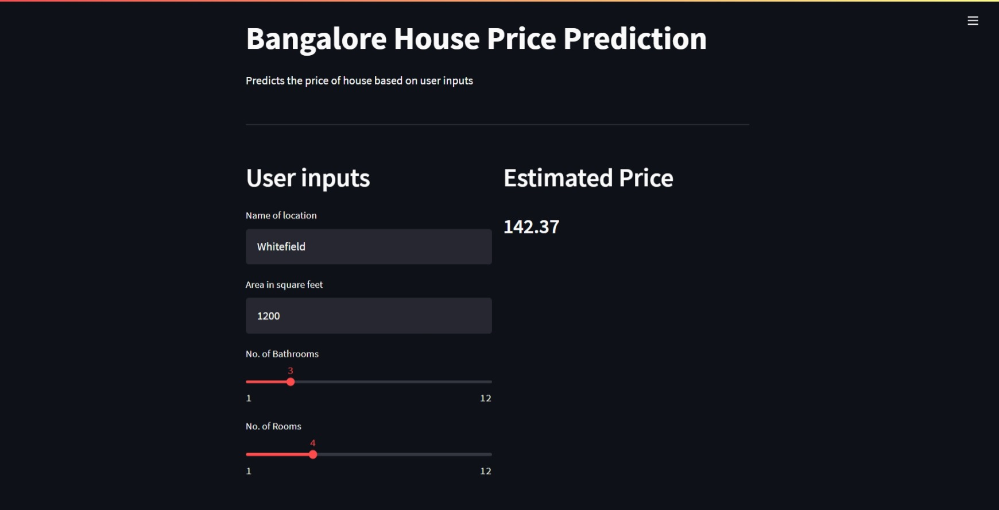

# [House Price Prediction](https://house-price-prediction.streamlit.app/)

This app predicts house prices in Bangalore with user-specified values

## Overview

- Pipeline
- Dataset
- Web app

## [Pipeline](https://github.com/Jobin-Nelson/House_price_prediction-project/blob/main/notebook/house_price_pred.ipynb)

- **EDA**: exploring the data to find relations among features and the target variable
- **Data cleaning**: cleaning the dataset for model training
- **Modeling**: training multiple models
- **Hyper-parameter tuning**: optimizing promising models with `Optuna`
- **Web app**: building a web app using `Streamlit`
- **Deployment**: deploying the app through `Heroku`

## [Dataset used](https://www.kaggle.com/amitabhajoy/bengaluru-house-price-data)

I’ve taken the dataset from Kaggle datasets. Required some data cleaning to make it suitable for the model to train on

## [Web app](https://bangalore-price-prediction.herokuapp.com/)

Used Streamlit to build the web app and deployed using Heroku platform by connecting to the heroku branch of this repo. You can view the app [here](https://house-price-prediction.streamlit.app/)

*Tools: Scikit-learn, Streamlit, Optuna,* *Pandas*
